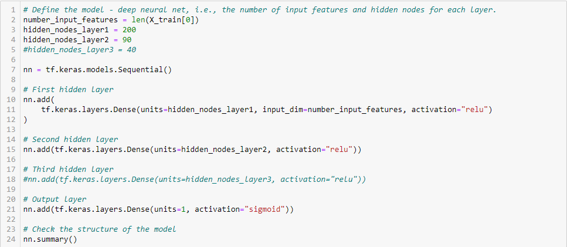
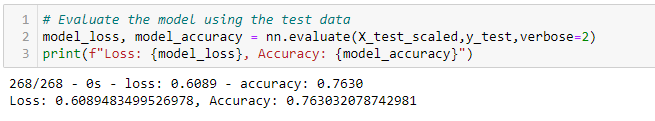

# Neural Network Charity Analysis
*Deep Learning ML*

## Project Overview Explain the purpose of this analysis.
For this project I am using **Neural Networks (also known as artificial neural networks, or ANN) Machine Learning algorithms** and Python **TensorFlow** library in order create a binary classifier that is capable of predicting whether applicants will be successful if funded by nonprofit foundation *Alphabet Soup*. This will help ensure that the foundation’s money is being used effectively. We are creating a robust deep learning neural network capable of interpreting large complex datasets. In order to use Neural Networks Machine Learning algorithms, we spend most time cleaning and preparing data for models. The actual coding can be as short as a few lines of code.

## Resources
-	Dataset [charity_data.csv](Resources/charity_data.csv)
-	Software: Jupyter Notebook
-	Languages: Python
-	Libraries: Scikit-learn, TensorFlow, Pandas
-	Environment: Python 3.7

## Results 

### Data Preprocessing

**What variable(s) are considered the target(s) for your model?**
Target output also known as dependent variable. That is our “IS_SUCCESSFULL” column. We are using this variable to train our ML model.

**What variable(s) are considered to be the features for your model?**
Input values also known as independent variables are considered to be features for the model. Those variables include all columns, except target variable and the one we dropped (“EIN" and "NAME”) in first trial and (“EIN”) for optimalization model.

**What variable(s) are neither targets nor features, and should be removed from the input data?**
The variables that should be removed and are neither targets nor features are variables that are meaningless for the model. The variables that don’t add to the accuracy to the model. One of the examples would be variables with all unique values. Another thing to keep in mind is to take care of the Noisy data and outliers. We can approach to this by dropping outliers or bucketing. 

### Compiling, Training, and Evaluating the Model
**How many neurons, layers, and activation functions did you select for your neural network model, and why?**
- I used 2 layers, because 3 layers didn’t contribute much to the improvement of the module. This is because the additional layer was redundant—the complexity of the dataset was encapsulated within the two hidden layers. Adding layers does not always guarantee better model performance, and depending on the complexity of the input data, adding more hidden layers will only increase the chance of overfitting the training data (1).
- I used **relu** activation function, since it has best accuracy for this model.
- I used 200 neurons for first layer and 90 neurons for second layer. As recommended first layer should have at least double the amount of input features, that is 100 input values (rows) in our case.
- I used **adam** optimizer, which uses a gradient descent approach to ensure that the algorithm will not get stuck on weaker classifying variables and features and to enhance the performance of classification neural network (2).
- As for the loss function, I used **binary crossentropy**, which is specifically designed to evaluate a binary classification model (2). 
- Model was trained on 500 epochs. I increase from 200 epoch was because the model improved a bit; however I did not increased for too many epoch in order to avoid overfitting. 

<i>Figure 1: Defining a Model.</i>

**Were you able to achieve the target model performance?**
After few configurations I was able to achieve the target model performance. The model accuracy improved to 76.30%. Figures below show accuracy score before optimization at the 72.41% and after optimization at 76.30%.

<i>Figure 2: Accuracy Before Optimization.</i>

<i>Figure 3: Accuracy After Optimization.</i>

**What steps did you take to try and increase model performance?**
In order to increase model performance, I took the following steps:

-	Checked input data and brought back **NAME** column, that was initially skipped. I set a condition on the values that are less than 50 in “Other” group. That reduced the number of unique categorical values by binning the values.
-	Binned the **ASK_AMT** values.
-	At first, I added the third layer with 40 neurons; however, I’ve changed back to 2 layers and because the results did not show better results. 
-	Increase neurons for each layer (200 for 1st, 90 for 2nd).
-	Increase Epochs to 500.

## Summary

***Summary of the results***
The model loss and accuracy score tell us how well the model does with the dataset and parameters that we build the model. Loss score is equal to 0.609, meaning the probability model to fail is 60.89% and accuracy score is 0.7630, meaning that the probability model to be accurate is 76.30%.

***Recommendation for further analysis***
After so fine-tuning the model reach accuracy score of 67.30%. Although the model reached the criteria it might not be the best model for this dataset. The loss score for that model is still about 60%, what is quite high. Dataset that we were working on seemed quite good fit because of the length of the dataset and its complexity, even though the results were the best. Adding new input values seemed good choice when improving the model accuracy, so in this case I would consider adding more input values (if there are available in the original dataset, for example). Another thing we could do, is to consider gathering more data. Although gathering more data is not always the easy decision is sometimes necessary. 

## References
-	(1) Module 19.4.1 Unleash the Hidden Potential of Neural Networks https://courses.bootcampspot.com/courses/200/pages/19-dot-4-1-unleash-the-hidden-potential-of-neural-networks?module_item_id=106809, Trilogy Education Services, 2000. Web 19 Nov 2020.
-	(2) Module 19.2.2 Build a Basic Neural https://courses.bootcampspot.com/courses/200/pages/19-dot-2-2-build-a-basic-neural-network?module_item_id=106775, Trilogy Education Services, 2000. Web 19 Nov 2020.

